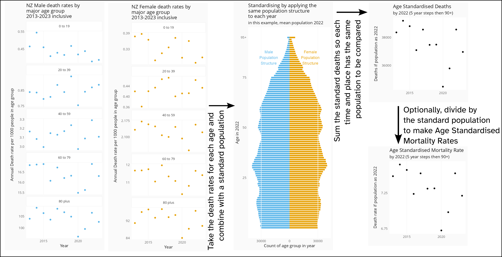
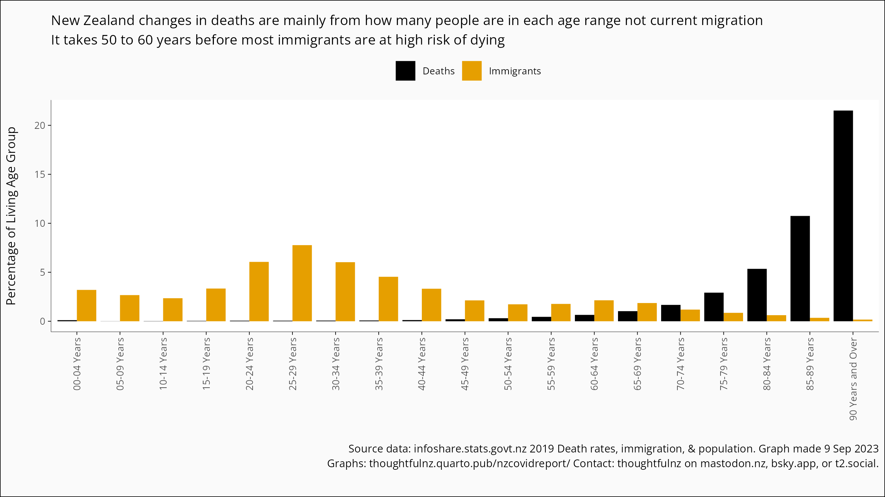
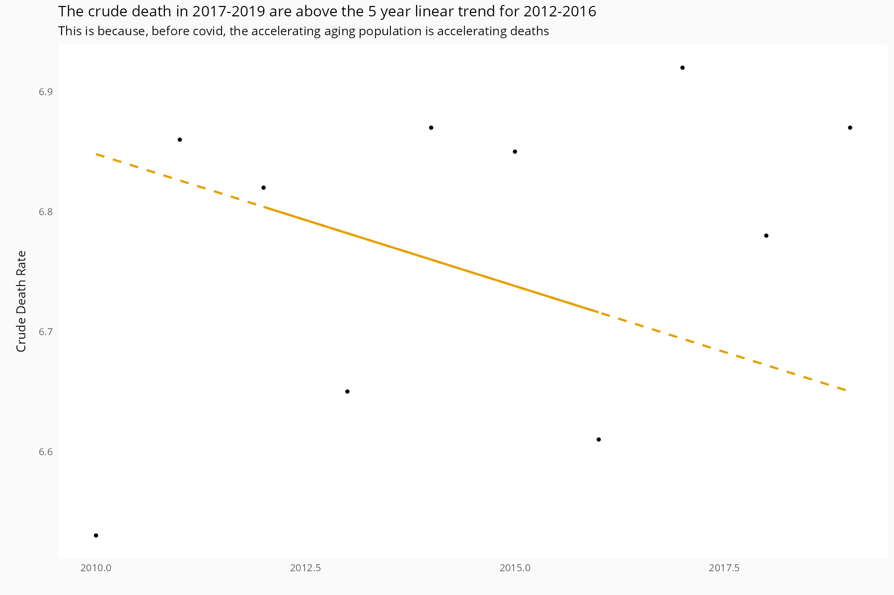

Draft open letter to editor
================

Things David knows he still needs to do:

- more proofreading

- clear easy to follow citations

- clear links to source data

To the editor and editorial board,

I am formally writing to point out the sgnificant errors in the paper
from Gibson (2024)[^1], published in your journal. In particular, the
paper asserts two claims:

- That claims of negative New Zealand mortality are underpinned by the
  “Our World In Data” projection graph using the method of check names
  all[^2].
- That Gibson’s method, producing positive excess mortality, is more
  effective than Karlinsky & Kobak in determining mortality as it
  adjusts for population change due to immigration changes.

Neither of these claims are accurate.

# The underpinning of New Zealand’s mortality measurement

For centuries, it has been established practice among actuaries,
demographers, and health researchers to measure mortality using death
rates by age where such data is available[^3]. This method superseded
Crude Mortality Rates, where CMR takes into account total population
change in comparisons by dividing the total number of deaths by the
total number of people available to die, improving CMR by acknowledging
that different ages have different risks of death, so comparing age-based
risk of death on a uniform basis. In New Zealand, tutorials on making
mortality comparisons by using death rates by age and standardising to a
reference population have been published since the 1890s[^4].

Age Standardised Mortality directly adjusts for both population growth and
aging, as it is based on the number of deaths of the current resident
population divided by the living current resident population, stratified
by age group and time period. This directly measures the population
change effects Gibson is trying to model.

While calculation of New Zealand’s cummulative excess mortality for
2020-2022 can vary by a couple of percentage points depending on the
exact method, using a death rates by age (standardised) method the
Institute of Actuaries find New Zealand’s excess mortality from week 10
2020 to the end of 2022 to be -4% (that there are 4% fewer deaths than
would be expected based on precovid trends)[^5].

The Our World in Data graph, and the K&K method that underlies it is an
approximation, and while if it is a better or worse approximation to
Gibson’s method will be discussed later, while recognising the Our World
In Data graph is an approximation there are still several practically
useful implicit features about it.

- Being based on trends of deaths, it enables a common basis comparison
  with countries that lack age stratified current population information
- It makes weekly comparisons available.
- Able to be checked by any member of the public for the latest current
  worldwide information. This last is a function of Our World in Data
  presentation rather than the method, but it is still a practical
  benefit.

While the existance of centuries of mortality measurement (not mentioned
in Gibson’s article) does not directly address if New Zealand medical
professionals are aware that best practice mortality calculations
recognise that people of different ages die at different rates when
using the publicly available Our World in Data graphs in media pieces,
it does establish that there is an established methodology, not mentiond
in Gibson’s article, underpinnning claims of New Zealand negative
excess, and that method has been used for centuries, world-wide, across
multiple disciplines. And we can check if New Zealand medical
professionals are aware of this by asking them- *“the key point being
any comparisons both within country (over time) or between countries
should be age standardised to provide the most accurate picture possible
(and of course be based on high quality and complete underlying deaths
data which we can say NZ’s are!)”*(Ashley Bloomfield) [^6]

## Age Standardised Mortality Review

As Age Standardised Mortality is a standard across multiple disciplines,
but is not raised in the Gibson paper, a brief review is in order.

Death rates for an age stratified group, for a time period in a given
location, measure that rate at which that age group dies. These can be
directly compared to death rates in other time periods and locations to
compare if the group experience is more or less deadly. As it is a rate,
it automatically adjusts for change in the population size of the age
group.

While this enables direct comparisons of people of the same age, it does
not enable total population comparisons (as total populations may have
different age structures). Standardisation with a reference population
addresses this by assessing the total population deaths on the basis of
death rates by age if the places and times being compared had the same
age structure.

*Figure 1*

<figure>

<figcaption aria-hidden="true">ASMR steps</figcaption>
</figure>

While some variation in calculation results can stem from choice of
standard population, due to the variation of young and old within a
population, pragmatically any population that can be argued to be
analytically useful should produce similar results. Using single year
ages groups by sex to 94 then 95+, and a linear baseline from 2013-2019,
a standard reference population of 2023 gives a cumulative excess of -5%
for 2020 to 2022. Using a standard reference population of 2021 when the
borders were restricted gives a cumulative excess of -6%. Using a
pre-covid standard population of 2019 gives a cumulative excess of -5%.
Using the standard population of 1961, used by StatsNZ to maintain
long-term continuity, cumulative excess is -5%.

### Baselines and excess mortality

Excess mortality is the difference to what is expected for mortality, so
excess calculations using any method are sensitive what is considered
normal- the baseline. For Age Standardised Mortality the normal process
is to use a linear trend of preceding years, and in the case of a major
multi-year event like a pandemic, the linear trend of pre-pandemic
years.

As New Zealand, no different to most other advanced economies, has seen
the rate of decrease in mortality slow over time, the length of the
linear trend baseline period should be short enough not to be
introducing error as a result of applying a straight line of best fit to
curved data.

<figure>

<figcaption aria-hidden="true">baseline</figcaption>
</figure>

Based on the influenza season patterns in recent pre-pandemic years, the
Australian Bureau of Statistics (ABS) considers 2013-2019 to give the
best baseline[^7]. New Zealand has seen a very similar history in this
period to Australia, with the added limitation that incorporating 2011,
the year of the Christchurch Earthquake and the residents of the second
largest city living in broken housing through the following winter, is a
poor influence point to use in a baseline as it is not a re-occurring
annual event.

While many international comparisons use a 5 year baseline range to
increase the number of countries for which weekly level data is
available, in practice the results for New Zealand do not differ
substantively between a 5 (2015-2019) and 7 (2013-2019) year baseline
period. A 5 year linear baseline with a 2022 standard population gives a
cumulative excess for the period of -5%, while a 7 year baseline gives a
cumulative baseline of -5%.

## Comparison of Gibson and Karlinsky & Kobak

Starting from a commonly recognised best practice measure of mortality,
age standised mortality, giving a cumulative excess mortality for
2020-2022 in the range of -4% to -6% depending on analytic assumptions,
we can compare other methods to that.

The Our World in Data Cummalative Excess (Projection based on Karlinsky
& Kobak) gives cumulative excess mortality for 2020-2022 as 0%

Gibson’s Population adjusted for changes in growth rates model gives an
excess mortality for 2020-2022 range of 1.7% to 5.3% with the central
estimate rounding to 4%.

Though not mentioned in the paper, adding the Population as a model term
to a death based model should be functionally equivalent to using the
commonly known Crude Mortality Rate (deaths among the total population /
total living population). And a 2015-2019 linear regression of the
annual CMR gives an excess of 1%.

Gibson’s method produces results further from actuarial standard methods
than the K&K method. The reason for Gibson’s model preforming so poorly
compared to K&K lies in implicitly misapplying death rates by age. Young
people migrate a lot and die little. Old people migrate little and die a
lot. Apply a correction based on the amount of migration to the
mortality of the total population (dominated by people not migrating)
introduces unnecessary structural error.

<figure>

<figcaption aria-hidden="true">Comparison of ages of migration and
death</figcaption>
</figure>

Conversely, because the K&K method only uses death data, it implicitly
limits itself to the population that dies. The population mainly dying
are not migrating, so it does not diverge as far from ASM as the Gibson
method when population changes take place that do not effect the
population at risk of death.

Gibson asserted that it was not important to incorporate aging

*If societal aging was a cause of the increased number of deaths, as
Gabel and Knox (2023) put forward as a reason for the excess mortality
in 2022, it should also show up prior to the COVID-19 era, given that
societal aging is a long-term process.*

It does show up before covid. If you do exactly the same type of
analysis, but before covid and the arguments around closing the border,
of comparing the crude death rate (which ignores aging but adjusts for
total population size) of the 3 years (2017-2019) after the 5 year
baseline (2012-2016) to the expected values of the baseline, then the
most recent three years are a cumulative 10% above baseline.

<figure>

<figcaption aria-hidden="true">Even if all years are before covid, the
post-baseline years are above trend</figcaption>
</figure>

I suggest anyone interested in this topic go explore population ages and
death rates at StatsNZ themeselves, and while there have a look at New
Zealand death rates by age, or indeed the public, downloadable
standardised death rates.

\[ Note only for the draft, for those with whom I had very early
discussions that the predicted results from Gibsons model are impossible
if you look at the change in population from 2019 to 2020 and the change
in deaths from 2019 to 2020, due to the young migrate/old die thing.
There were 2 reasons: (1) The model Gibson used in his article is
sufficiently undocumented I cannot exactly replicate is claims over 3
years, so making a claim about 1 year is filed with assumptions that
there would be distracting quibble fights about. (2) While it
demonstrates this particular model is impossible, that distracts from
the general point that Age Standardised Mortality Rates exist, are
industry standard, and shouldn’t be ignored.\]

[^1]: Reference to a footnote.

[^2]: Ariel Karlinsky, Dmitry Kobak (2021) Tracking excess mortality
    across countries during the COVID-19 pandemic with the World
    Mortality Dataset eLife 10:e69336

[^3]: 1767 whatever

[^4]: NZ statistical handbook 1890

[^5]: Actuaries Institute: CMI Working Paper 180
    https://www.actuaries.org.uk/learn-and-develop/continuous-mortality-investigation/cmi-working-papers/mortality-projections/cmi-working-paper-180

[^6]: Ashley Bloomfield, 2024, personal communication

[^7]: Australian Bureau of Statistics.
    https://www.abs.gov.au/articles/measuring-australias-excess-mortality-during-covid-19-pandemic-until-first-quarter-2023#methodology
