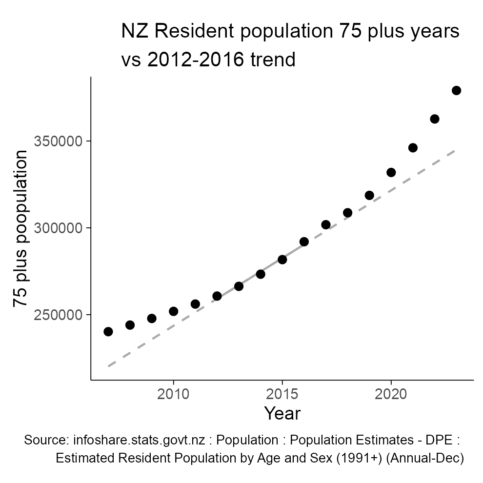

Comment on Cumulative Excess Deaths in New Zealand in the COVID-19 Era:
Biases from Ignoring Changes in Population Growth Rates
================
David Hood
7/12/24

This is the Github repo for my letter of comment on Gibson’s article.
The letter references the code data files in the supportFiles folder
available here. For context, the final draft/ preprint of the letter is
included below, though this final draft may differ slightly from any
published version.

While the data files and R code for generating the results and figures
is available in the support folder, as not everyone is familiar with R,
I am also providing an [Excel file in the
supportFiles](supportFiles/ASMR_in_Excel.xlsx) folder (use the download
raw files button in the upper right of the Excel file screen) which
implements the normal Age Standardised Mortality steps so that people
can review and test the logic themselves. It shows the steps of:

1)  Obtain annual resident population by age data from
    https://infoshare.stats.govt.nz : Population : Population
    Estimates - DPE : Estimated Resident Population by Age and Sex
    (1991+) (Annual-Dec) : Mean year ended, both Male and Female, 0 -94
    then 95+, years 2013-2022

2)  Obtain annual resident death by age data from
    https://infoshare.stats.govt.nz : Population : Deaths - VSD : Deaths
    by age and sex (Annual-Dec) : both Male and Female, 0 -99 then 100+,
    years 2013-2022

3)  Combine the 95 to 100 + categories in the death data to the same age
    range as the population data (95+) in order to be able to match
    people of the same age in the same year

4)  calculate death rates for each age group of residents for each year.

5)  Multiple the individual age death rates in each year by a standard
    population, so that total death changes between years are considered
    on the basis of the same population and age structure in every year,
    to avoid mistaking non-fatal changes in population size and
    structure as changes in risk of death. In this example, the New
    Zealand population of 2022 is used

6)  Total the standard deaths for each year, to generate the number
    (based on death rates) of deaths if the population had been the same
    as the year of the standard population, but the age specific risk of
    death was the same as the historical period.

7)  Preform a regression on the years 2013-2019 to account for trends
    beyond changes to the population value. The expected value as a
    result of the regression corrects for historical trends such as the
    improvement in health understanding and care (as per the article
    2013-2019 is considered the optimal baseline for Australasia without
    triggering structural bias)

8)  Project the regression trend into 2020 through 2022 to determine
    expected deaths given a population structure of the standard year.
    Compared them to actual standardised deaths

9)  Cumulative excess is sum(actual)/sum(expected) - 1 expressed as a
    percentage.

The letter of comment preprint included below, as well as providing a
[PDF version of the preprint](letter_to_ed_pdf.pdf) among the files of
this repo:

------------------------------------------------------------------------

For hundreds of years, correctly measuring mortality has been a concern
of actuaries, demographers, and health researchers. Accurate measurement
should form the basis of insurance risk pricing and government policy.
Writing in this journal, Gibson (Gibson, 2024) asserts that New Zealand
authorities’ measurement of mortality in the pandemic period is based on
a flawed metric. Gibson’s own metric, based on regression of deaths with
an additive component of total population, is asserted as a more
accurate model and produces approximately 4% excess mortality for the
2020-2022 period. If New Zealand authorities are using flawed metrics
with significantly different results to reality, the thousands of
unnoticed deaths would have profound governance and policy implications.

In particular, I interpret the paper as asserting two broad claims:

- That claims of negative New Zealand mortality are underpinned by the
  “Our World In Data” projection graph using the method of (Karlinsky &
  Kobak, 2021) [^1].
- That Gibson’s method, producing positive excess mortality, is more
  effective than Karlinsky & Kobak in determining excess mortality as it
  adjusts for immigration-based changes in the rate of population
  growth.

Neither of these claims are accurate.

## The underpinning of New Zealand’s mortality measurement

It has been established professional practice for centuries to measure
mortality using age-adjusted death rates where such data is available
(Price, 1773). This method supersedes the use of Crude Mortality
Rates[^2] by acknowledging that different ages have different risks of
death, so comparing age-based risk of death on a uniform basis. In New
Zealand, tutorials on making mortality comparisons by using death rates
by age and standardising to a reference population have been published
since the 1890s (Didsbury et al., 1891).

Age Standardised Mortality directly adjusts for both population growth
and aging, as it is based on the number of deaths of the current
resident population divided by the current resident population,
stratified by age group and time period. This directly measures the
population change effects Gibson is trying to model, and does so at the
level of residents of that age in each time period.

While calculation of New Zealand’s cumulative excess mortality for
2020-2022 can vary by a couple of percentage points depending on the
exact method adopted, using an age-standardised death rates method the
UK’s Institute and Faculty of Actuaries finds New Zealand’s excess
mortality from week 10 2020 to the end of 2022 to be -4% (that there are
4% fewer deaths than would be expected based on pre-COVID-19 trends)
(Institute & Faculty of Actuaries, 2024).

The Our World in Data graph, and the Karlinsky and Kobak method that
underlies it, is an approximation (if it is a better or worse
approximation to Gibson’s method will be discussed later). While
recognising the Our World In Data graph is an approximation, there are
still several practically useful implicit features about it:

- Being based on trends only of deaths, it enables a common, consistent
  basis comparison with countries that lack age stratified current
  population information, or indeed countries that lack any current
  population information. As Gibson notes, Karlinsky and Kobak were
  initially able to provide comparison data for 103 countries (later
  127). By contrast the mortality.org website has weekly death rates by
  age (suitable for age standard mortality comparisons) for 38
  countries[^3].
- It makes weekly comparisons available.
- It is able to be checked by any member of the public for the latest
  current worldwide information. This last is a function of Our World in
  Data presentation rather than the method, but it is still a practical
  benefit.

Centuries of mortality measurement establishes that it is best practice
in mortality calculations to recognise that people of different ages die
at different rates. While New Zealand medical professionals have used
the Karlinsky and Kobak method/ Our World in Data graphs in media
presentations, it is not established if that was for the above practical
benefits while still being aware of more accurate methods, or because K
& K was considered definitive. We can check if New Zealand medical
professionals are aware of best practice methods by asking them.

> ‘…*the key point being any comparisons both within country (over time)
> or between countries should be age standardised to provide the most
> accurate picture possible (and of course be based on high quality and
> complete underlying deaths data which we can say NZ’s are!)*’
> (Bloomfield, 2024)

## Age Standardised Mortality Review

As Age Standardised Mortality is a standard across multiple disciplines,
but is not raised in the Gibson paper, a brief review is in order.

Death rates for an age stratified group, for a time period in a given
location, measure the rate at which that age group dies. These can be
directly compared to death rates in other time periods and locations to
measure if the group experience is more, or less, deadly. As it is a
rate, it automatically adjusts for differences in the size of the age
group.

While this enables direct comparisons of people of the same age, it does
not enable total population comparisons (as total populations may have
different age structures). Standardisation with a reference population
addresses this by assessing the total population deaths on the basis of
death rates by age if the places and times being compared had the same
age structure.

The total of standardised deaths can optionally be divided by the
standard population to make age standardised mortality rates.

Some variation in calculated results can be caused by the choice of
standard population, due to the variation of young and old within a
population. However, pragmatically, variations arising from the choice
of standard population are likely to be immaterial to the results. Using
single year age death rates by sex to 94 then 95+, and a linear baseline
from 2013-2019, a standard reference population of 2023 gives a
cumulative excess[^4] of -2% for 2020 to 2022. Using a standard
reference population of 2021 when the borders were restricted gives a
cumulative excess of -2%. Using a pre-COVID-19 standard population of
2019 gives a cumulative excess of -2%. Using the standard population of
1961, used by Stats NZ to maintain long-term continuity, cumulative
excess is -2%[^5].

For calculating age specific death rates, using detailed annual StatsNZ
age counts of resident deaths and population prevents inaccuracy in
results from overly broad age groups. In 2019 the age specific death
rate[^6] of 10-14 year olds (0.17 per 1000 residents of that age per
year) approximately doubles by age 15-19 (0.41), and doubles again by
35-39 (0.83). More doubling takes place by 45-49 (1.95), 55-59 (4.45),
and 65-69 (10.27). With the speed of doubling being even faster in older
aged that make up the majority of deaths, mortality measurements can be
very sensitive to even a few years of change in the population balance.
Any method calculating cumulative excess using shorter individual time
periods should, if correct, produce the same result for the same total
time period.

Excess mortality is the difference between actual mortality and what is
expected. The expected value is an estimate based on certain underlying
premises, so excess mortality calculations using any method are
sensitive to what is considered “normal”: the baseline. For Age
Standardised Mortality the regular process is to use a linear trend of
preceding years, and where trying to measure the impact of a major
multi-year event like a pandemic, the linear trend of pre-pandemic
years.

As New Zealand, no different to most other advanced economies, has seen
the rate of decrease in mortality slow over time, the length of the
linear trend baseline period should be short enough not to be
introducing error as a result of applying a straight line of best fit to
curved data.

After thorough investigation of the data, the Australian Bureau of
Statistics (ABS) considers 2013-2019 to give the best baseline for the
pandemic period (Australian Bureau of Statistics, 2023). New Zealand has
seen a similar trend in mortality in this period to Australia, with the
added limitation that using 2011, the year of the Christchurch
Earthquake and the residents of the second largest city living in broken
housing through the following winter, is an extremely poor choice to
include in baselines as such an event is not a reoccurring annual one.

While many international studies use a 5 year baseline range to increase
the number of countries for which weekly level data is available, in
practice the results for New Zealand do not differ substantively between
a 5 (2015-2019) and 7 (2013-2019) year baseline period. Using a 2022
standard population and a 2015-2019 baseline gives -2% excess mortality
for 2020-2022, while using a 2013-2019 baseline gives -2%[^7].

## Comparison of Gibson and Karlinsky & Kobak

To assess the accuracy of approximations of mortality, the difference of
an approximation to age-standardised mortality methods can be measured.
Earlier age-stratified methods give a cumulative excess mortality for
2020-2022 in the -2% to -4% range.

The Our World in Data cumulative excess (Projection based on Karlinsky &
Kobak) gives cumulative excess mortality for 2020-2022 as 0%.

Gibson’s model gives an excess mortality for 2020-2022 range of 1.7% to
5.3% with the central estimate rounding to 4%.

Though not mentioned in Gibson’s paper, the commonest method for
measuring deaths in relation to total population (without adjusting for
aging) is the Crude Mortality Rate (deaths among the total resident
population / total living resident population). This is available for
any country producing both an annual count of resident deaths and an
annual resident population count. A 2015-2019 linear regression of the
annual CMR[^8] gives an 2020-2022 cumulative excess of 0%. This
establishes that a method not adjusting for age, as might be logically
expected in a country with an aging population, gives a higher value for
excess than a method that adjusts for age.

Gibson’s method produces results further from actuarial standard methods
than the Karlinsky & Kobak method. The reason for Gibson’s model
performing so poorly compared to Karlinsky & Kobak lies in the age
imbalance of death rates. Young people frequently migrate and
infrequently die (see Figure 1). Old people infrequently migrate and
frequently die. Applying a correction based on the amount of migration
to the mortality of the total population (dominated by people not
migrating) introduces structural error.

<figure>

<figcaption aria-hidden="true">Ages of migration and ages of death have
little overlap</figcaption>
</figure>

Conversely, because the Karlinsky & Kobak method uses only death data,
it implicitly limits itself to the population that dies. The population
mainly dying are not migrating, so the model does not diverge as far
from age standardised mortality as the Gibson method when border changes
cause major fluctuations in migration.

If 2020 had the same single year of age death rates as 2019, and new
migrant 2020 death rates were the same as the equivalently aged
non-migratory population in 2019, then we can calculate the expected
deaths from the 35,744 reduction in net migration from 2019 to 2020.
Using single age death rates, the youthful migrating population would be
expected to result in 85 fewer deaths for the 35,744 reduction in total
population[^9].

Conversely, the expected increase in deaths due to aging can be
calculated by aging the 2019 resident population by one year, and
subtracting annual deaths of that age, and applying the single year
death rates of 2019 (the same assumption as deaths expected from
migration). For the resident population, excluding under one year olds,
there would be an expected rise of 837 deaths while the total population
decreased by about 33,963[^10].

Gibson’s decision not to apply total population but not age to the model
minimises an expected increase in deaths of an approximate order of
magnitude greater than the effects of migration. But all these
complexities are avoided by incorporating both migration and aging by
using age standardised mortality.

Gibson asserted that it was not important to incorporate aging “If
societal aging was a cause of the increased number of deaths, as Gabel
and Knox (2023) put forward as a reason for the excess mortality in
2022, it should also show up prior to the COVID-19 era, given that
societal aging is a long-term process.” (Gibson, 2024, pp.5)

The assumption that aging is a long-term process so should show up as a
long slow process only applies if there are no sudden demographic shifts
among age groups that alter the risk of death. In the pre-COVID-19 era,
tautologically, the baseline for COVID-19 comparisons and trends are
automatically best fit the data of the pre-covid period, to see the
pre-COVID-19 rise is aided by using a slightly earlier baseline.

The number of 75 and older residents has been growing at an accelerating
rate in the decade prior to COVID-19 (see Figure 2). This matches a
“sudden” demographic shift of an acceleration in the age distribution
that began decades earlier and naturally aged into ranges that play a
more significant role in total deaths.

<figure>

<figcaption aria-hidden="true">The elderly population grew at an
accelerating rate in the decade before COVID-19</figcaption>
</figure>

But the dramatic increase in elderly is only one of several interacting
factors contributing to mortality. Others are factors influencing the
age specific risk environment. A more direct measure of the importance
of age stratification is the difference in outcome between the Crude
Mortality Rate (ignoring age structure) and the Age Standardised
Mortality Rate (based on age stratified death rates). The difference in
excess mortality between those two methods of 2% to 4% is the difference
caused by not using age specific death rates.

Of more surprise than the comparison to age standardised methods is that
Gibson’s results for 2020-22 less well approximate the crude mortality
rate than Karlinsky & Kobak, since the crude mortality rate is the
normal method of comparing death rates while ignoring the effects of
age. This may be the result of the unusual step of treating population
as an additive contributor to deaths in his modification of Karlinsky &
Kobak. But, compared to the differences with methods acknowledging age,
such problems are minor.

Karlinsky & Kobak also appears superior for comparisons between
countries, as Gibson’s results are a worse approximation with ASMR (Age
Specific Mortality Rate) based methods calculated by other countries
statistical authorities. The Australian Bureau of Statistic’s age based
mortality analysis has excess mortality of 3.4% across 2020-2022
(Australian Bureau of Statistics, 2023). Karlinsky & Kobak’s
approximation of 4% is much closer to the ABS result than Gibson’s
result of -3%.

## Conclusion

Specific methods are employed to achieve particular objectives, such as
broadening the scope of comparison. It is reasonable to critique the use
of such methods if they are applied to different objectives, such as
ensuring accuracy on a country-specific level. However, in making such
critiques, it is essential to identify the current best practices for
achieving that specific objective. Additionally, when making claims
about enhanced accuracy, it is crucial to benchmark each method against
the most accurate standard to establish the comparative value of
different approaches.

From comparison to best practice ASMR methods, K&K are closer in result
than Gibson’s method. Further, given the results of ASMR, New Zealand
and international professionals have a sound basis for determining New
Zealand’s excess mortality as negative for the covid period.

## References

Australian Bureau of Statistics. (2023). *Measuring Australia’s excess
mortality during the COVID-19 pandemic until the first quarter 2023 \|
Australian Bureau of Statistics*.
<https://www.abs.gov.au/articles/measuring-australias-excess-mortality-during-covid-19-pandemic-until-first-quarter-2023>

Bloomfield, A. (2024). *Personal communication*.

Didsbury, G., New Zealand Registrar-General’s Office, Lands, N. Z. D.
of, Survey, Smith, S. P., & Ginders, A. (1891). *Report on the
statistics of New Zealand ...: with map of the colony.* By authority:
George Didsbury, Government Printer, Wellington.
<https://www3.stats.govt.nz/historic_publications/1890-official-handbook/1890-official-handbook.html>

Gibson, J. (2024). Cumulative excess deaths in New Zealand in the
COVID-19 era: biases from ignoring changes in population growth rates.
*New Zealand Economic Papers*, *58*(1), 95–106.
<https://doi.org/10.1080/00779954.2024.2314770>

Institute, & Faculty of Actuaries. (2024). *International excess
mortality*.
<https://www.actuaries.org.uk/learn-and-develop/continuous-mortality-investigation/cmi-working-papers/mortality-projections/cmi-working-paper-180>

Karlinsky, A., & Kobak, D. (2021). Tracking excess mortality across
countries during the COVID-19 pandemic with the World Mortality Dataset.
*eLife*, *10*, e69336. <https://doi.org/10.7554/eLife.69336>

Price, R. (1773). *Observations on Reversionary Payments: On Schemes for
Providing Annuities for Widows, and for Persons in Old Age; on the
Method of Calculating the Values of Assurances on Lives; and on the
National Debt. To which are Added, Four Essays on Different Subjects in
the Doctrine of Life Annuities and Political Arithmetick. Also, an
Appendix and Supplement, Containing Additional Observations, and a
Complete Set of Tables ... The Third Edition, Much Enlarged*. T. Cadell.

[^1]: The analysis code for (Karlinsky & Kobak, 2021) is available from
    https://github.com/dkobak/excess-mortality

[^2]: The Crude Mortality Rate (CMR) is a simple calculation of the
    total number of deaths in a population divided by that population.
    The CMR allows comparability of populations of different sizes, but
    does not make any allowance for differences in composition between
    populations

[^3]: The count of 38 countries was obtained from counting the countries
    in the STMF metadata file
    https://mortality.org/File/GetDocument/Public/STMF/DOC/STMFmetadata.pdf

[^4]: Using the standard cumulative excess measure of
    100\*((sum(actual)/sum(expected)) -1).

[^5]: NZ annual deaths are available from
    https://infoshare.stats.govt.nz in Population : Deaths - VSD :
    Deaths by age and sex (Annual-Dec). NZ mean annual population is
    available from Population : Population Estimates - DPE : Estimated
    Resident Population by Age and Sex (1991+) (Annual-Dec) : Mean year
    ended. The 1961 age standardised mortality rate figures are in
    Population: Death Rates - DMM : Standardised death rates (Maori and
    total population) (Annual-Dec). Raw data and analysis code at
    https://github.com/thoughtfulbloke/letter2ed in the support_files
    folder.

[^6]: https://infoshare.stats.govt.nz/ Population : Death Rates - DMM :
    Age-specific death rates by sex, December years (total population)
    (Annual-Dec)

[^7]: Raw data and analysis code at
    https://github.com/thoughtfulbloke/letter2ed in the support_files
    folder.

[^8]: NZ crude death rates are available from
    https://infoshare.stats.govt.nz in Population : Death Rates - DMM
    Crude death rate (Maori and total population) (Annual-Dec). Raw data
    and analysis code at https://github.com/thoughtfulbloke/letter2ed in
    the support_files folder.

[^9]: NZ migration data available from https://infoshare.stats.govt.nz
    in Tourism : International Travel and Migration - ITM : Table:
    Estimated migration by direction, age group and sex, 12/16-month
    rule (Annual-Dec). NZ death data available in Population : Deaths -
    VSD : Deaths by age and sex (Annual-Dec). NZ population data
    available in Population : Population Estimates - DPE : Estimated
    Resident Population by Age and Sex (1991+) (Annual-Dec). Raw data
    and analysis code at https://github.com/thoughtfulbloke/letter2ed in
    the support_files folder.

[^10]: NZ death data available from https://infoshare.stats.govt.nz in
    Population : Deaths - VSD : Deaths by age and sex (Annual-Dec). NZ
    population data available in Population : Population Estimates - DPE
    : Estimated Resident Population by Age and Sex (1991+) (Annual-Dec).
    Raw data and analysis code at
    https://github.com/thoughtfulbloke/letter2ed in the support_files
    folder.
